# pokedex-ranking-data

Projeto em Python com Flask e Selenium para coletar dados da PokéAPI e exibi-los em uma interface web temática de Pokédex, com ranking, análise tática e montagem de estratégia ofensiva.


## Vídeo de exemplo

<video controls width="100%">
  <source src="assets/video/pokemon.mp4" type="video/mp4">
  Seu renderizador de Markdown não suporta vídeo incorporado. Use o link abaixo para abrir o arquivo.
</video>

[Abrir vídeo de exemplo](assets/video/pokemon.mp4)

## Visão geral

O projeto sobe um servidor Flask local, abre a interface automaticamente no navegador e executa a coleta de Pokémon em segundo plano com Selenium.

Enquanto a coleta acontece, a interface atualiza em tempo real:

- progresso atual
- logs de execução
- cards dos Pokémon coletados
- ranking Top 10 por soma de stats
- estado da estratégia tática

Além da coleta, a aplicação também permite:

- pausar e retomar a execução sem perder o progresso
- apagar o estado atual e o JSON salvo
- configurar navegador, timeout, janela e intervalo das requisições
- abrir uma carta 3D interativa de cada Pokémon
- montar um time estratégico com base nos Pokémon capturados
- rodar um teste tático para avaliar o plano gerado

## Principais funcionalidades

- Coleta de dados da PokéAPI com Selenium
- Extração de tipos, stats, imagem e cadeia de evolução
- Dois modos de coleta:
  - por quantidade de Pokémon
  - busca do Pokémon mais forte de todos os tempos
- Ranking automático com os 10 Pokémon mais fortes
- Persistência em `dados/pokedex.json`
- Configuração do Selenium diretamente pela interface
- Pausa e retomada de coleta
- Carta 3D com frente dinâmica e verso em `assets/card.jpg`
- Menu de contexto personalizado e suporte a arrastar e soltar
- Área de estratégia para:
  - analisar os capturados taticamente
  - montar um time de 3 a 6 slots
  - priorizar Pokémon específicos
  - sugerir golpes e plano de batalha
  - testar a estratégia com métricas e recomendações

## Arquitetura

### Backend

- `pokedex_ranking_data.py`
  - servidor Flask
  - controle do estado global
  - rotas HTTP
  - fluxo de coleta com Selenium
  - persistência do JSON
- `analise_tatica.py`
  - enriquecimento tático dos Pokémon coletados
  - classificação de papel tático
  - análise de cobertura, riscos e resistências
  - montagem do time estratégico
  - teste tático da estratégia atual

### Frontend

- `templates/dashboard/index.html`
  - estrutura principal da interface
- `assets/css/`
  - estilos do dashboard, da configuração e da carta
- `assets/js/`
  - lógica da interface
  - atualização de estado
  - configuração
  - carta 3D
  - tela de estratégia

### Persistência

O arquivo `dados/pokedex.json` é gerado ao fim da coleta e salva:

- metadados da execução
- lista dos Pokémon coletados
- Top 10 dos mais fortes

## Estrutura atual do projeto

```text
pokedex-ranking-data/
|-- .gitignore
|-- .venv/                          # ambiente virtual local
|-- __pycache__/                    # cache gerado pelo Python
|-- analise_tatica.py
|-- pokedex_ranking_data.py
|-- README.md
|-- requirements.txt
|-- assets/
|   |-- card.jpg
|   |-- diagrama_selenium.svg
|   |-- favicon.png
|   |-- readme.svg
|   |-- video/
|   |   `-- pokemon.mp4
|   |-- css/
|   |   |-- card/
|   |   |   `-- carta.css
|   |   |-- configuracao/
|   |   |   `-- configuracao.css
|   |   `-- dashboard/
|   |       |-- base.css
|   |       `-- dashboard.css
|   `-- js/
|       |-- card/
|       |   `-- carta_3d.js
|       |-- configuracao/
|       |   `-- configuracao.js
|       `-- dashboard/
|           |-- dashboard.js
|           |-- estado.js
|           `-- estrategia.js
|-- dados/
|   `-- pokedex.json
`-- templates/
    `-- dashboard/
        `-- index.html
```

## Fluxo de execução

1. O usuário executa `pokedex_ranking_data.py`.
2. O Flask sobe em `http://127.0.0.1:5000`.
3. A interface é aberta automaticamente no navegador.
4. O frontend consulta `GET /estado` periodicamente.
5. Ao iniciar a coleta, o backend cria uma thread dedicada.
6. O Selenium percorre a PokéAPI e atualiza o estado em memória.
7. A interface renderiza progresso, logs, cards, ranking e estratégia em tempo real.
8. Ao finalizar, o backend grava `dados/pokedex.json`.



## Estratégia tática

A camada tática usa os Pokémon já coletados para montar um plano ofensivo mais útil do que um ranking simples de stats.

Ela faz:

- classificação de papel tático de cada Pokémon
- leitura de fraquezas, resistências e imunidades
- sugestão de golpes com apoio do Selenium
- montagem de time com 3 a 6 integrantes
- criação de plano de batalha, cobertura e riscos
- teste tático com pontuação de `0` a `100`

Na interface, o fluxo é:

1. coletar Pokémon
2. abrir a área de estratégia
3. escolher tipo alvo, estilo e tamanho do time
4. opcionalmente priorizar capturados específicos
5. clicar em `Montar estratégia`
6. clicar em `Rodar teste tático`

Os estilos disponíveis são:

- `agressiva`
- `equilibrada`
- `segura`

## API local

### `GET /`

Renderiza a interface principal da Pokédex.

### `GET /estado`

Retorna o estado atual da aplicação, incluindo:

- execução (`em_execucao`, `pausado`, `resumivel`)
- progresso (`atual`, `total`)
- logs
- lista de Pokémon
- ranking
- estratégia atual
- configuração ativa
- último erro, quando existir

### `POST /iniciar`

Inicia uma nova coleta.

Exemplo de payload:

```json
{
  "modo": "quantidade",
  "quantidade": 151
}
```

Observações:

- `modo` pode ser `quantidade` ou `mais_forte`
- quando o modo é `mais_forte`, o backend descobre automaticamente o total de Pokémon disponível na PokéAPI
- para execução real, o backend aceita valores de `1` a `2000`

### `POST /continuar`

Retoma uma coleta pausada anteriormente.

### `POST /parar`

Solicita a pausa da coleta em andamento.

### `POST /apagar`

Limpa o estado da aplicação e remove `dados/pokedex.json`, quando o arquivo existir.

### `POST /configuracao`

Atualiza a configuração de execução do Selenium.

Exemplo de payload:

```json
{
  "navegador": "chrome",
  "headless": true,
  "timeout_segundos": 25,
  "largura_janela": 1700,
  "altura_janela": 1100,
  "intervalo_ms": 0
}
```

Observações:

- navegadores aceitos: `chrome`, `edge` e `firefox`
- se não houver coleta em andamento, a configuração é validada antes de ser salva
- se houver coleta em andamento, a nova configuração passa a valer na próxima execução

### `POST /estrategia`

Gera uma estratégia ofensiva com base nos Pokémon já capturados.

Exemplo de payload:

```json
{
  "tipo_alvo_primario": "fire",
  "tipo_alvo_secundario": "flying",
  "estilo": "agressiva",
  "tamanho_time": 4,
  "ids_prioritarios": [6, 149]
}
```

Observações:

- `estilo` pode ser `agressiva`, `equilibrada` ou `segura`
- `tamanho_time` é limitado entre `3` e `6`
- `ids_prioritarios` é opcional

### `POST /estrategia/testar`

Executa o teste tático da estratégia atual.

O retorno inclui:

- valor geral da estratégia
- classificação do plano
- métricas de ofensiva, consistência, sinergia, execução e cobertura
- cenários avaliados
- leitura individual dos integrantes
- recomendações de ajuste

## Formato do JSON gerado

Exemplo simplificado de `dados/pokedex.json`:

```json
{
  "gerado_em": "2026-03-11T16:00:00.000000",
  "projeto": "pokedex-ranking-data",
  "versao": "3.0.0",
  "modo": "quantidade",
  "quantidade": 151,
  "pokemons": [
    {
      "id": 6,
      "nome": "charizard",
      "tipos": ["fire", "flying"],
      "stats": {
        "hp": 78,
        "attack": 84,
        "defense": 78,
        "special-attack": 109,
        "special-defense": 85,
        "speed": 100
      },
      "total_stats": 534,
      "evolucoes": ["charmander", "charmeleon", "charizard"],
      "imagem": "https://raw.githubusercontent.com/PokeAPI/sprites/master/sprites/pokemon/other/official-artwork/6.png",
      "papel_tatico": "sweeper especial",
      "fraquezas": ["water", "electric", "rock"],
      "resistencias": ["fire", "grass", "fighting", "steel", "fairy"],
      "imunidades": ["ground"],
      "golpes_recomendados": [],
      "score_estrategia": 87.4
    }
  ],
  "top10_mais_fortes": []
}
```

## Requisitos

- Python 3.10 ou superior
- Um navegador instalado:
  - Google Chrome
  - Microsoft Edge
  - Mozilla Firefox
- Dependências listadas em `requirements.txt`

Dependências atuais:

- `flask`
- `selenium`

## Instalação e execução

### Windows (PowerShell)

```bash
python -m venv .venv
.venv\Scripts\activate
pip install -r requirements.txt
py .\pokedex_ranking_data.py
```

### Linux/macOS

```bash
python3 -m venv .venv
source .venv/bin/activate
pip install -r requirements.txt
python3 pokedex_ranking_data.py
```

Ao executar:

- o servidor local sobe em `http://127.0.0.1:5000`
- a interface é aberta automaticamente no navegador
- o terminal mostra mensagens de inicialização em português

## Configurações e limites validados

O backend aplica os seguintes limites:

- `quantidade`: `1` até `2000`
- `timeout_segundos`: `5` até `120`
- `largura_janela`: `900` até `3000`
- `altura_janela`: `600` até `2000`
- `intervalo_ms`: `0` até `5000`

## Solução de problemas

- Erro ao iniciar o navegador no Selenium:
  - confirme se o navegador escolhido está instalado
  - teste outro navegador na tela de configuração
  - salve a configuração novamente para forçar a validação
- Coleta muito lenta:
  - use o modo headless
  - reduza a quantidade de Pokémon
  - deixe `intervalo_ms` em `0`
- Falha ao montar estratégia:
  - verifique se já existem Pokémon coletados
  - confirme se a configuração atual do Selenium está funcional
- Porta `5000` em uso:
  - encerre o processo que está usando a porta
  - ou altere `host` e `porta` em `iniciar_servidor()`

## Destaques da versão 3.0.0

- Novo módulo `analise_tatica.py`
- Estratégia ofensiva montada a partir dos capturados
- Sugestão de golpes e leitura tática por integrante
- Teste tático com classificação do plano
- Integração da estratégia diretamente na interface principal
